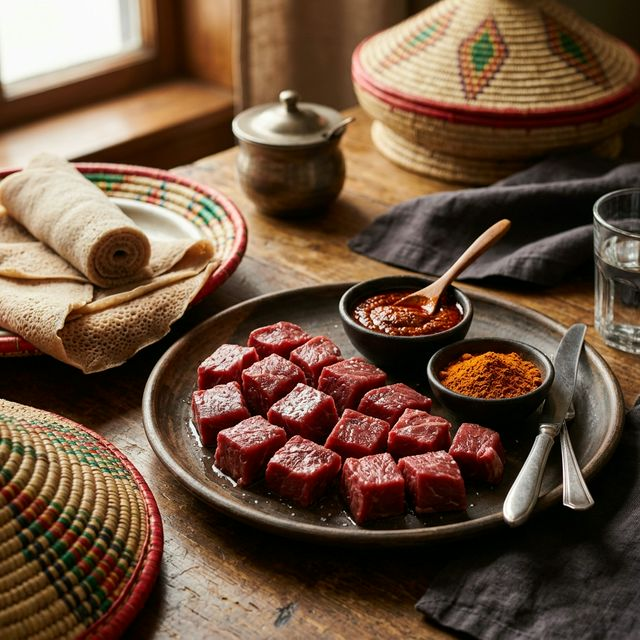

<div align="center">

  <br />

  <h2 align="center">Sheger Kurt - Restaurant & Bar Website</h2>

  Sheger Kurt is a fully responsive restaurant & bar website and powerful dynamic management system,<br />
  Responsive for all devices, built using HTML, CSS, JavaScript, and PHP.

  <a href="https://shegerkurt.onrender.com"><strong>➥ Live Demo</strong></a>

</div>

<br />

### Demo Screenshots



### Prerequisites

Before you begin, ensure you have met the following requirements:

* [Git](https://git-scm.com/downloads "Download Git") must be installed on your operating system.
* PHP ^8.0 & MySQL server (using XAMPP locally).

### Run Locally

To run **Sheger Kurt** locally, run this command in your git terminal:

Windows and macOS:

```bash
git clone https://github.com/Mequannent28/shegerkurt.git
```

Set up your local Apache/MySQL server (like XAMPP) and access the project through `localhost`. If running for the first time, navigate to `setup_database.php` in your browser to bootstrap the database securely!

### Contact

If you want to contact me you can reach me at [Mequannent Gashaw](mailto:mequannentgashaw12@gmail.com).

### License

This project is custom developed. All rights reserved by the developer.
